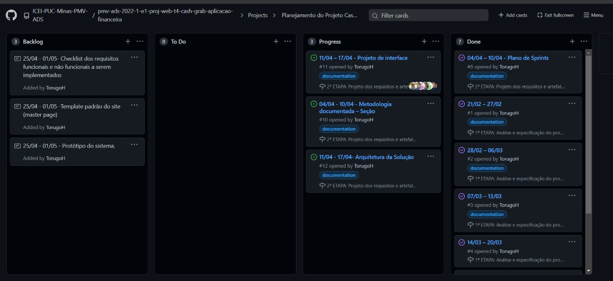

# Metodologia

Pré-requisitos: <a href="2-Especificação do Projeto.md"> Documentação de Especificação</a>

## Relação de Ambiente de Trabalho
Para que tenhamos uma boa produtividade no desenvolvimento do nosso software iremos usar as seguintes ferramentas:

|Ambiente                        | Plataforma            |Link de Acesso                                           |
|--------------------------------|-----------------------|-------------------------------------------------------------------------------------------------------------------------------------------------------------------------------------------------------|
|Documentos do Projeto           |One Drive              |https://sgapucminasbr-my.sharepoint.com/personal/1348060_sga_pucminas_br/_layouts/15/onedrive.aspx?id=%2Fpersonal%2F1348060%5Fsga%5Fpucminas%5Fbr%2FDocuments%2FFinancial%20Development&ga=1|
|Repositório de Código Fonte      |Git Hub                |https://github.com/ICEI-PUC-Minas-PMV-ADS/pmv-ads-2022-1-e1-proj-web-t4-cash-grab-aplicacao-financeira |
|Projeto de Interface e wireframes |Figma                  |https://www.figma.com/file/wtE4oNQYDHGfG6yDz6Y1iU/?node-id=110%3A511                                                                        |
|Gerenciamento de Projeto          |Git Action             |https://github.com/ICEI-PUC-Minas-PMV-ADS/pmv-ads-2022-1-e1-proj-web-t4-cash-grab-aplicacao-financeira/projects/1                  |

## Controle de Versão

Para gestão do nosso codigo fonte utilizaremos o git hub para o versionamento

O projeto segue a seguinte convenção para o nome de branches:

- `main`: versão estável já testada do software
- `dev`: versão de desenvolvimento do software

Quanto à gerência de issues, o projeto adota a seguinte convenção para
etiquetas:

- `documentation`: melhorias ou acréscimos à documentação
- `bug`: uma funcionalidade encontra-se com problemas
- `enhancement`: uma funcionalidade precisa ser melhorada
- `feature`: uma nova funcionalidade precisa ser introduzida

## Gerenciamento de Projeto

### Divisão de Papéis

Para gerenciamento do projeto utilizaremos a metodologia ágil scrum. 

Nossa equipe se encontra organizada da seguinte maneira:  

Matheus Ferreira Pires - Desenvolvedor 
Matheus Lemos Sampaio – Design e Desenvolvedor 
Pedro Assis Silva de Almeida -  Product Owner e Desenvolvedor 
Renato Batista Duarte de Sousa - Desenvolvedor 
Vinícius Eduardo Silva Oliveira - Desenvolvedor 
Vitor Hugo Silva Ribeiro- Scrum Master e Desenvolvedor

### Processo

Para organização e distribuição de tarefas do projeto, utilizaremos o Git Action estruturado da seguinte forma: 

Product Backlog: Nessa parte fica todas as tarefas que vão ser desenvolvidas no projeto. Caso apareça alguma nova e direcionada nessa parte. 
To Do (Sprint Backlog): E a sprint atual que estamos trabalhando. 
Progress: Quando a tarefas foi iniciada. 
Done: Quando a tarefa for finalizada. 

O quadro kanban do grupo no Git Action disponível em https://github.com/ICEI-PUC-Minas-PMV-ADS/pmv-ads-2022-1-e1-proj-web-t4-cash-grab-aplicacao-financeira/projects/1, na Figura 2 mostra com ele está.

### Ferramentas

As ferramentas empregadas no projeto são:

- Editor de código - VS Code
- Ferramentas de comunicação - Discord e Teams
- Ferramentas de desenho de tela - Figma

O editor de código Vscode foi escolhido pela sua facil integração com o GitHub. Já as ferramentas de comunicação Discord e Teams foram escolhidas pelo fato dos integrantes do grupo terem familiaridade com elas e por fim, o Figma foi escolhido por ser uma ferramenta bem recomentdada para o que precisavamos.

