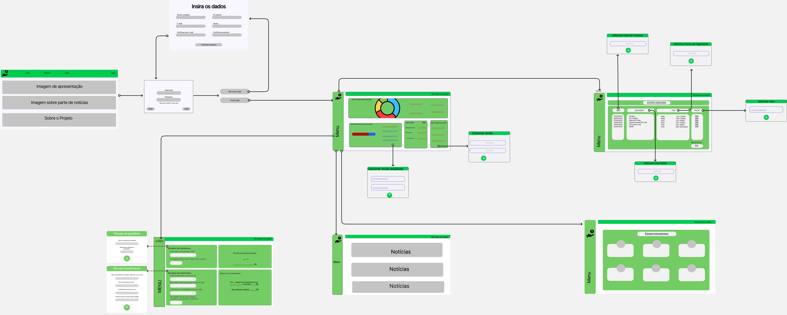
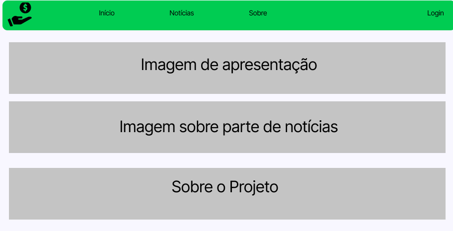
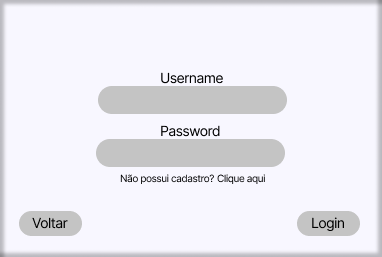
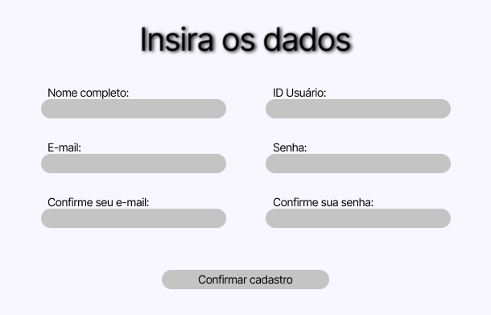
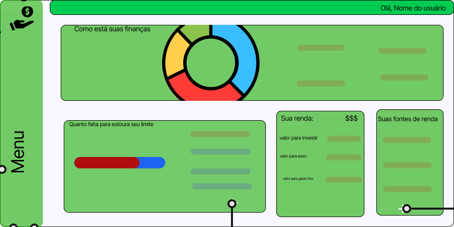
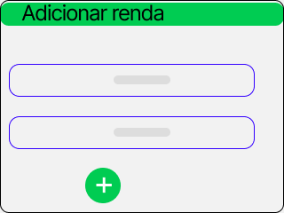

# Projeto de Interface

Pré-requisitos: <a href="2-Especificação do Projeto.md"> Documentação de Especificação</a>

Visão geral da interação do usuário pelas telas do sistema e protótipo interativo das telas com as funcionalidades que fazem parte do sistema (wireframes).

 Apresente as principais interfaces da plataforma. Discuta como ela foi elaborada de forma a atender os requisitos funcionais, não funcionais e histórias de usuário abordados nas <a href="2-Especificação do Projeto.md"> Documentação de Especificação</a>.

## User Flow

Fluxo de usuário (User Flow) é uma técnica que permite ao desenvolvedor mapear todo fluxo de telas do site ou app. Essa técnica funciona para alinhar os caminhos e as possíveis ações que o usuário pode fazer junto com os membros de sua equipe.

> **Links Úteis**:
> - [User Flow: O Quê É e Como Fazer?](https://medium.com/7bits/fluxo-de-usu%C3%A1rio-user-flow-o-que-%C3%A9-como-fazer-79d965872534)
> - [User Flow vs Site Maps](http://designr.com.br/sitemap-e-user-flow-quais-as-diferencas-e-quando-usar-cada-um/)
> - [Top 25 User Flow Tools & Templates for Smooth](https://www.mockplus.com/blog/post/user-flow-tools)

## Wireframes
Tela 1 – Tela Inicial 

Esta será a tela de apresentação da nossa aplicação, onde terá uma sobre o projeto, um informativo sobre nossa parte de notícias e uma parte com informações do projeto. Nesta tela encontra-se também, o campo para realizar o login. 

Tela 1.1 - Login 

Tela aonde serão informados o nome e a senha do usuário para acessar a aplicação. 

Tela 1.2 - Cadastro Login 

Tela aonde será realizado o cadastro inicial do usuário, para que seja possível acessar a aplicação. 

 
 Tela 2- Despesas e renda do usuário. 

Nessa tela o usuário poderá ver suas despesas, o valor que falta para seu cartão estoura e suas fontes de renda. Também será possível adicionar novos gastos e nova fontes. 

Tela 2.1 - Adicionar novas despesas 

Modal onde o usuário colocar a nova despesa, no campo de cima fica o nome e no de baixo o valor 

> **Links Úteis**:
> - [Protótipos vs Wireframes](https://www.nngroup.com/videos/prototypes-vs-wireframes-ux-projects/)
> - [Ferramentas de Wireframes](https://rockcontent.com/blog/wireframes/)
> - [MarvelApp](https://marvelapp.com/developers/documentation/tutorials/)
> - [Figma](https://www.figma.com/)
> - [Adobe XD](https://www.adobe.com/br/products/xd.html#scroll)
> - [Axure](https://www.axure.com/edu) (Licença Educacional)
> - [InvisionApp](https://www.invisionapp.com/) (Licença Educacional)
