# Projeto de Interface

Pré-requisitos: <a href="2-Especificação do Projeto.md"> Documentação de Especificação</a>

Visão geral da interação do usuário pelas telas do sistema e protótipo interativo das telas com as funcionalidades que fazem parte do sistema (wireframes).

## User Flow
O diagrama apresentado a seguir, mostra o fluxo de interação do usuário pelas telas do sistema. Cada uma das telas deste fluxo é detalhada na seção de Wireframes que se segue 

.
## Wireframes
Tela 1 – Tela Inicial 

 Esta será a tela de apresentação da nossa aplicação, onde terá uma sobre o projeto, um informativo sobre nossa parte de notícias e uma parte com informações do projeto. Nesta tela encontra-se também, o campo para realizar o login. 

Tela 1.1 - Login 

 Tela aonde serão informados o nome e a senha do usuário para acessar a aplicação. 

Tela 1.2 - Cadastro Login 

 Tela aonde será realizado o cadastro inicial do usuário, para que seja possível acessar a aplicação. 

 
Tela 2- Despesas e renda do usuário. 

 Nessa tela o usuário poderá ver suas despesas, o valor que falta para seu cartão estoura e suas fontes de renda. Também será possível adicionar novos gastos e nova fontes. 

Tela 2.1 - Adicionar novas despesas 

 Modal onde o usuário colocar a nova despesa, no campo de cima fica o nome e no de baixo o valor 

Tela 2.2- Adicionar fonte de renda 

 Modal onde o usuário colocar sua fonte de renda. No primeiro espaço a identificação da renda e no segundo o valor 

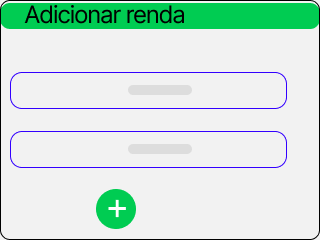

Tela 3 - Controle de Extrato Bancários  

Tela 3.1 - Conforme modelo abaixo, disponibilizamos a visualização do controle de gastos diários, semanais e mensais. Na tela principal poderá ser inserido as informações completas de gastos do usuário.  

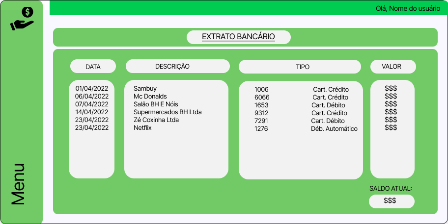

Tela 3.2 - Na aba datas, poderá ser inserido as datas de compras do Usuários. 

 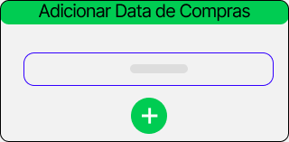

Tela 3.3 - Para que o usuário possa saber o que foi efetuado no seu extrato foi disponibilizado a aba de descrições conforme a imagem abaixo. 

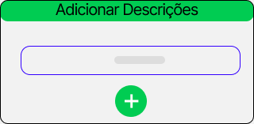
 
Tela 3.4 - Na aba de tipos poderá ser inseridos todas as formas de pagamentos disponíveis. 

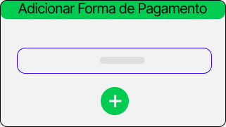

Tela 3.5 - Ao realizar o clic em adicionar valores esse o último passo para o controle do seu extrato, conforme as informações inseridas anteriormente os valores serão somados no final do extrato automaticamente.   

 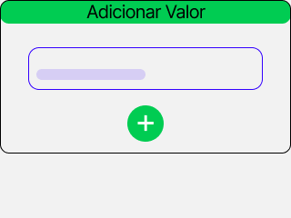

Tela 4 - Simulações de Empréstimos e Investimentos. 

 Nessa tela o usuário poderá simular valores e prazos de empréstimos. Também será possível uma simulação de investimento no perfil que o usuário mais se encaixa. 

 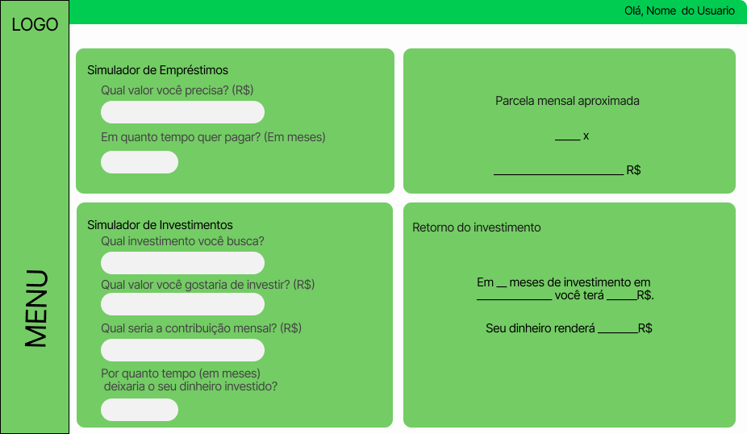
Tela 4.1 - Adicionar valor e prazo de empréstimo. 

 Modal onde permite ao usuário a indicar o valor e o prazo de empréstimo desejado. 

 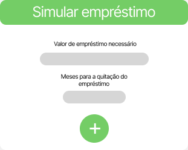
 
Tela 4.2 - Adicionar moldes do investimento desejado. 
 Modal que permite ao usuário escolher o investimento que mais lhe encaixa, indicar os valores, prazo do investimento e contribuição mensal (se houver). 

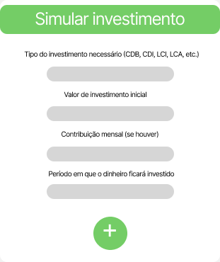
 
Tela 5- Tela de Noticias
 Nessa tela ficar noticias sobre o mundo financeiro

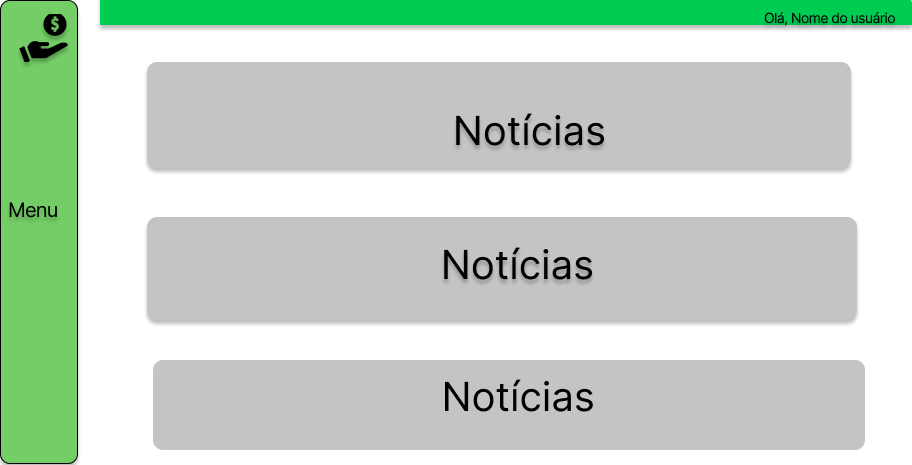

Tela 6 - Sobre nós. 

 Descrição dos integrantes e desenvolvedores do grupo. 

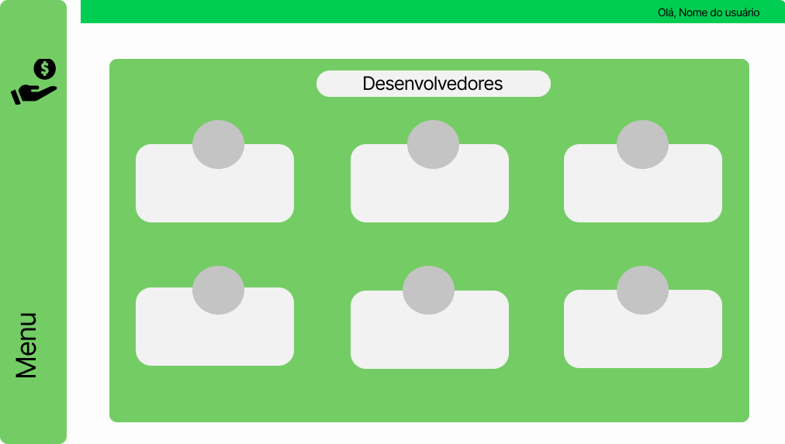
