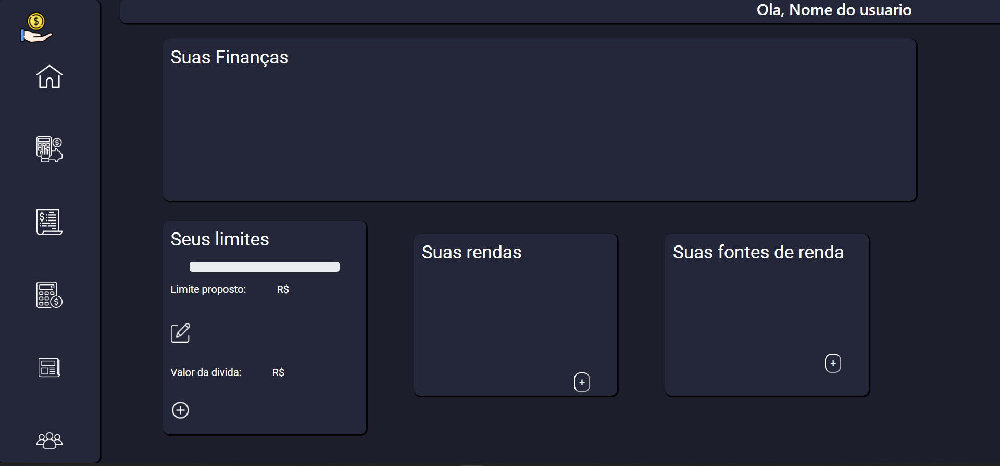

# Template padrão do site
## Tela de Inicio
A tela inicial do site é apresentada com uma curta descrição do nosso objetivo e tem o seguinte layout:

Nesta tela possuímos os seguintes detalhes:

    1- Layout: Nesta primeira página, decidimos utilizar um layout baseado em Single Page Applications(SPA), para que fique de manuseio mais fácil ao usuário.

    2- Barra de Navegação: Barra  no topo do site, onde ao clicar no tópico desejado, o site irá encaminhar o usuário para o campo correspondente.

Ao clicar no botão "Login", será aberto a tela (modal) abaixo:

Caso o usuário não tenha realizado um cadastro, o mesmo irá clicar no campo onde é informado para clicar e realizar o cadastro.
O usuário será redirecionado para a página abaixo:

## Demais telas
As telas do site terá seu layout conforme o da figura abaixo:

O layout é composto pelos itens:

    1- Barra de Navegação: Barra na lateral será a forma em que o usario consiga acessar todas as funcionalidades do nosso site. Quando o usuario passa o mouse por cima dos icones do menu, será mostrado o titulo do que e que ele está tentando acessar.

    2- Barra indentificação do usuário: Nessa parte mostra o nome de quem está utilizando o site.

    3- Parte de Conteúdo: Nessa parte as disposição dos conteudos se modam de acordo com a pagina que ele está. Assim trazendo uma melhor experiencia no uso do site.

