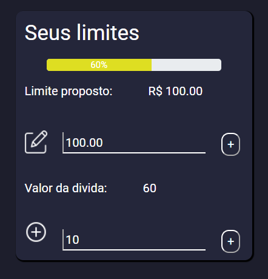

# Programação de Funcionalidades

Pré-requisitos: <a href="2-Especificação do Projeto.md"> Especificação do Projeto</a>, <a href="3-Projeto de Interface.md"> Projeto de Interface</a>, <a href="4-Metodologia.md"> Metodologia</a>, <a href="3-Projeto de Interface.md"> Projeto de Interface</a>, <a href="5-Arquitetura da Solução.md"> Arquitetura da Solução</a>

Implementação do sistema descritas por meio dos requisitos funcionais e/ou não funcionais. Deve relacionar os requisitos atendidos os artefatos criados (código fonte) além das estruturas de dados utilizadas e as instruções para acesso e verificação da implementação que deve estar funcional no ambiente de hospedagem.

Para cada requisito funcional, pode ser entregue um artefato desse tipo

## Tela de despesas (RF-01)

    Na tela de despesas o usuario do site poderar ver sua vida finaceira de forma mais ampla. Nessa tela fica seus limites, suas despesas, suas fontes de renda.

### Funcionalidade RF-01
    Essa funcionalidade permite que o usuario crie um controle de gastos com o limite pré estabelecido pelo mesmo, e quando vai acresentando novas dividas a barra de status mostra a situação como está. Uma ilustração da funionalidade na imagem abaixo

