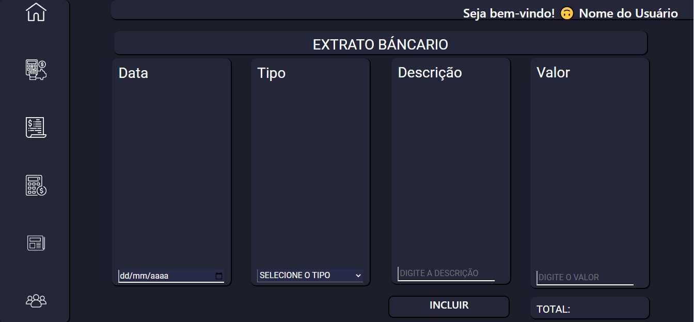
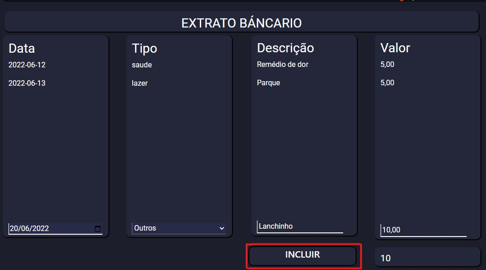

# Programação de Funcionalidades

Pré-requisitos: <a href="2-Especificação do Projeto.md"> Especificação do Projeto</a>, <a href="3-Projeto de Interface.md"> Projeto de Interface</a>, <a href="4-Metodologia.md"> Metodologia</a>, <a href="3-Projeto de Interface.md"> Projeto de Interface</a>, <a href="5-Arquitetura da Solução.md"> Arquitetura da Solução</a>

Implementação do sistema descritas por meio dos requisitos funcionais e/ou não funcionais. Deve relacionar os requisitos atendidos os artefatos criados (código fonte) além das estruturas de dados utilizadas e as instruções para acesso e verificação da implementação que deve estar funcional no ambiente de hospedagem.

Para cada requisito funcional, pode ser entregue um artefato desse tipo

## Tela de cadastro de usuário
Nesta tela o usuário podera realizar o seu cadastro para acessar o sistema.

### Funcionalidade cadastro
Essa funcionalidade irá captar os dados inseridos pelo usuário como nome, e-mail e senha, para incluir no localstorage e assim podemos ter o controle de qual usuário está acessando no sistema.

## Tela de despesas (RF-01)
Na tela de despesas o usuario do site poderar ver sua vida finaceira de forma mais ampla. Nessa tela fica seus limites, suas despesas, suas fontes de renda.

### Funcionalidade RF-01
Essa funcionalidade permite que o usuario crie um controle de gastos com o limite pré estabelecido pelo mesmo, e quando vai acresentando novas dividas a barra de status mostra a situação como está. Uma ilustração da funionalidade na imagem abaixo

### Despesas em formato de grafico (RF-02)
Nessa funcionalidade o usuario consigará ter uma grande noção de onde seu dinheiro esta sendo aplicado

### Notificação do usuario (RF-03)
Implementação da funcionalidade de notificação ao usaurio sobre o seus gasto. Abaixo uma imagem do algoritimo implementado.

### Inclusão das despesas atuais e despesas futuras (RF-04)
Nessa funcionalidade, será possivel ao usuario ver as suas despesas atuais e futuras, com um somatorio de dividas do mês. Segue abaixo, uma imagem do algoritmo implementado.

## Tela de Simulacoes (RF-05) e (RF-07)
    A tela de simulações permitirá ao usuário acessar e simular juros de empréstimos e rendimentos de investimentos a sua escolha.

  

### Funcionalidade (RF-05)
    Essa funcionalidade concederá ao usuário uma simulação de empréstimo, calculando juros ao mês, e lhe informando o valor de cada parcela referente a sua solicitação nos campos de preenchimento como mostra a imagem a seguir.

    

## Tela de Extrato
    Com a tela de extratos o usuario terá todas as informações sobre o movimento dos seus gastos, terá a possibilidade de vizualizar e incluir sua lista de despesas conforme imagem abaixo.

 

## Funcionalidades do Extrato
    A seguinte segue implementação do código para o funcionamento das principais funcionalidades aplicadas.

### Funcionalidade Data (RF-4)
    Essa funcionalidade possibilita ao usuário incluir as datas das suas compras para um controle pessoal dinâmico. 

### Funcionalidade Tipo
    Na funcionalide tipo implementamos um select pre estabelecido para que o usuário possa selecionar o tipo de despesa que aproxima-se da compra realizada.

### Funcionalidade Descrição
    Nessa funcionalidade o Usuário poderá incluir a descrição da compra realizada.

### Funcionalidade Valor e Total
    Nessa funcionalidade o usuário poderá incluir os valores das compras realizadas, após incluir os valores em númerais a soma será realizada automaticamente na conteiner total conforme imagem abaixo. 

### Funcionalidade Incluir (RF-6)
    A funcionalidade apresentada a seguir está entre as mais inportantes, pois com a ajuda do localStorage, ela e a reponsável pelo envio e armazenamento das informações colocadas pelo usuário.
   

    Observando se que o usário precisará conferir se todos os campos estão preenchidos e conforme desejado, após isso poderá selecionar o campo "Incluir" para armazenar suas informações.

   

