# Registro de Testes de Software

## Caso de teste 01 - Realizar o cadastro do usuário

1- Caso de sucesso: Usuário cadastrado do sistema.

2- Caso de Insucesso: Mensagem de erro informando para preencher os campos.

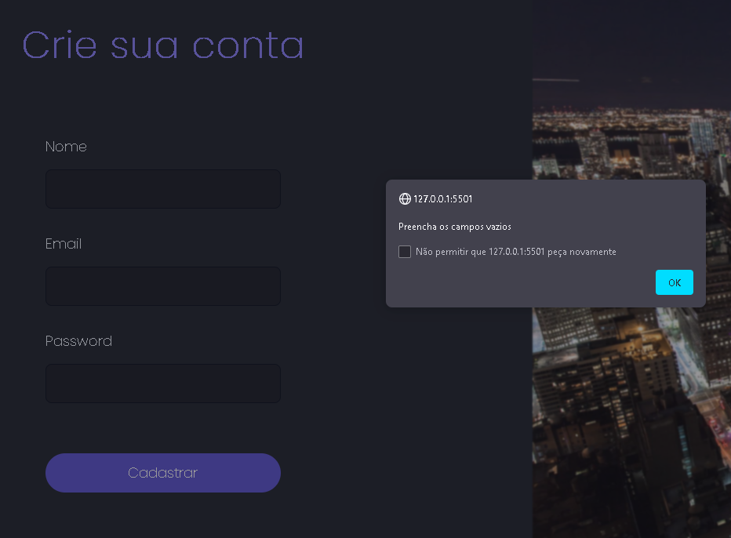

## Caso de teste 02 - Validação do e-mail no cadastro

1- Caso de sucesso: Sistema permite prosseguir com a inserção dos dados.

2- Caso de Insucesso: Mensagem de erro informando que o e-mail inserido é inválido.

## Caso de teste 01 - Realizar o login

1- Caso de sucesso: Login permitirá acessar o sistema.

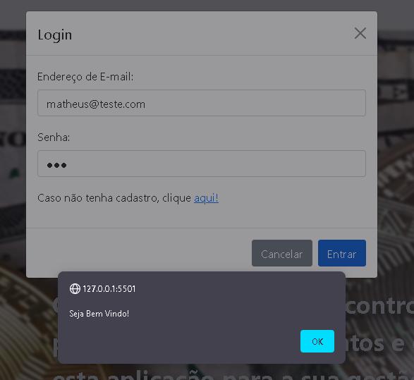

2- Caso de Insucesso: Mensagem de erro informando que o usuário não está cadastrado.

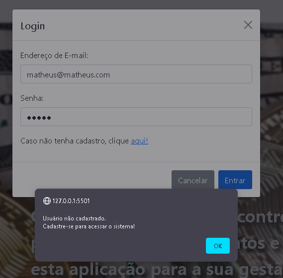

## Caso de teste 02 - Preenchimento dos campos

1- Caso de sucesso: Sistema permitirá realizar o login.

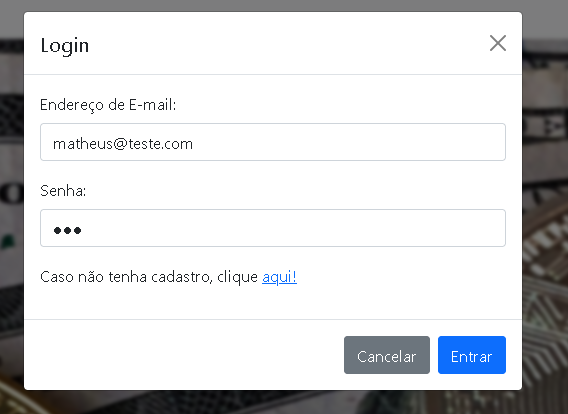

2- Caso de Insucesso: Mensagem de erro informando para o usuário preencher os campos.

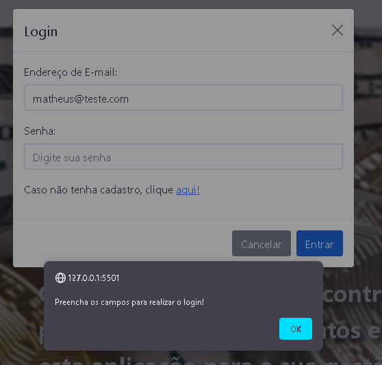

## Caso de teste 03 - Validação do e-mail do login

1- Caso de sucesso: Sistema não apresentará mensagem de erro.

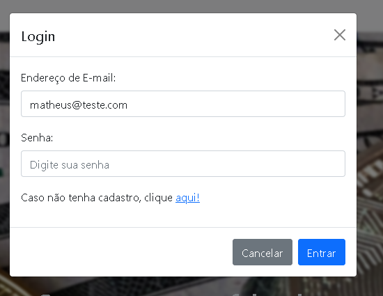

2- Caso de Insucesso: Mensagem de erro informando que o e-mail é inválido.

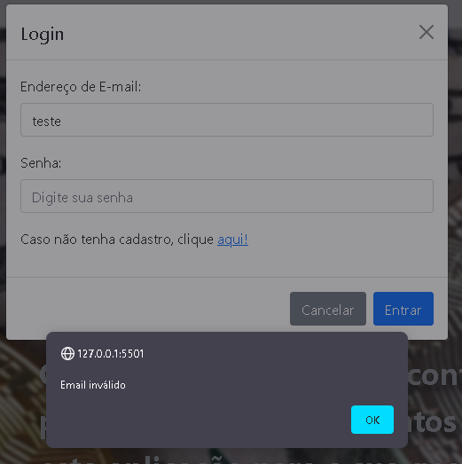

## Caso de teste 01 - Criação de um controlador de gastos

1- Caso de sucesso: Dados aparecem na tela.

2- Caso de Insucesso: Mensagem de erro com o campo vazio.

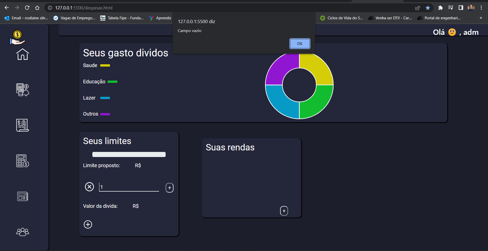

## Caso de teste 02 - Envio de alerta por email

1- Caso de sucesso: Email enviado caso o usuario ultrapasse 60% do valo estipulado

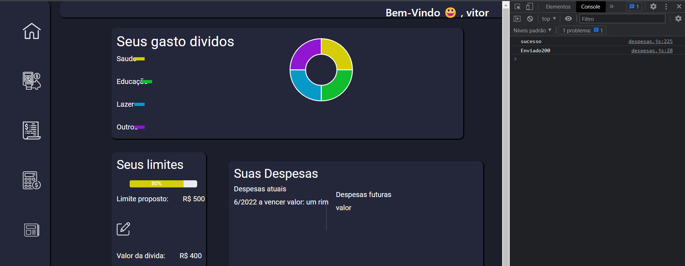

2- Caso de Insucesso: Email não enviado por está invalido.

## Caso de teste 03- Possibilidade da visualização de despesas atuais e futuras

1- Caso de sucesso: Somatorio das dividas Aparecendo corretamente.

2- Caso de insucesso: Valor das Dividas aparecendo zerado.

 

## Caso de teste 04 - Mostra Grafico em formato de pizza 

1- Caso de Sucesso: Grafico apresenta as cores e seus respectivos valores

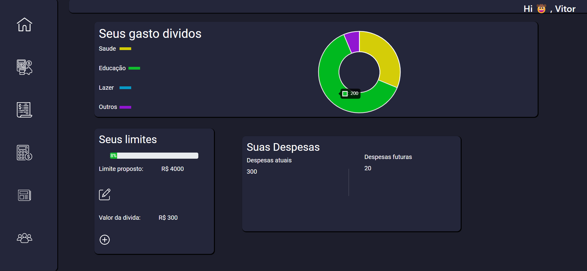

2 - Caso de insucesso:  Grafico de uma única cor

## Caso de teste 01 - Vizualização das datas de compra

1- Caso de sucesso: As datas inceridas pelo usuário aparecem na tela.

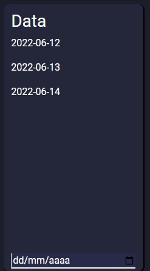

2 - Caso de insucesso:  Caso o usuário não preencha a data de sua compra o envio para o localStorage não poderá ser relizado.

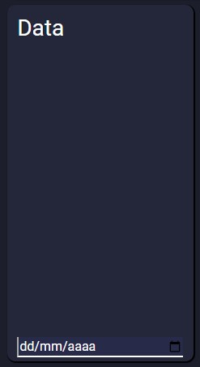

## Caso de teste 02 - Vizualizar o tipo de compra

1- Caso de sucesso: O usuário poderá escolher o tipo de compra que mais se assemelha com o produto comprado.

2 - Caso de insucesso:  Caso o usuário não selecione o tipo do porduto comprado não será possivel a vizualização e armazenamento de seus dados, ficado totalmente e impossibilidado de seguir para o proximo bloco. 

## Caso de teste 03 - Vizualização e inclusão das descrições

1- Caso de sucesso: O usuário poderá declarar as descrições da suas compras conforme imagem abaixo.

2 - Caso de insucesso:  Caso o usuário não preecha o campo de digitação os dados não poderam ser vizualizados e armazenados, ficado o campo totalmente limpo. 

## Caso de teste 04 - Soma dos valores inceridos

1- Caso de sucesso: Após a inclusão dos valores gastos pelo Usuário temos uma auto soma dos valores.

2 - Caso de insucesso:  Caso o usuário não inclua o valor em numeral a soma não poderá ser realizada.

## Caso de teste 05 - Inclusão de todas informações

1- Caso de sucesso: Após a inclusão de todas as informações o usuário poderá vizualizar seus dados quando quiser e de onde quiser.

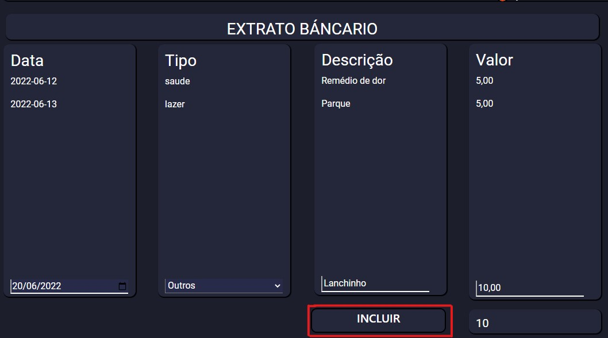

2- Caso de insucesso: Caso o usuário não ensira todas as informações os dados não poderam ser vizualizados.

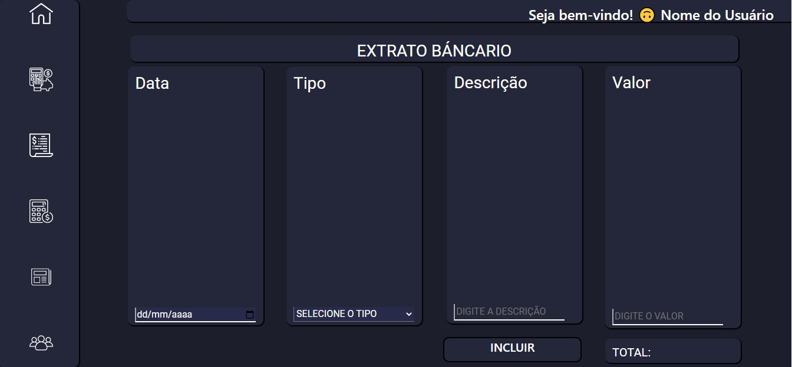

## Caso de Teste 1 - Simulação de empréstimo

1- Caso de sucesso: Cálculo das parcelas e valores aparecendo de forma correta.

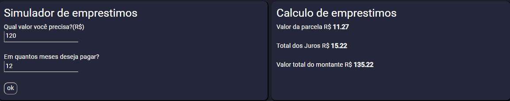

2- Caso de insucesso: Caso não insira nenhum valor de parcela ou de empréstimo e aperte 'ok' o sistema mostra a mensagem 'NaN' no retorno.

## Caso de Teste 2 - Simulação de Investimento

1- Caso de Sucesso: Cálculo dos aportes iniciais e mensais aparecendo de forma correta.

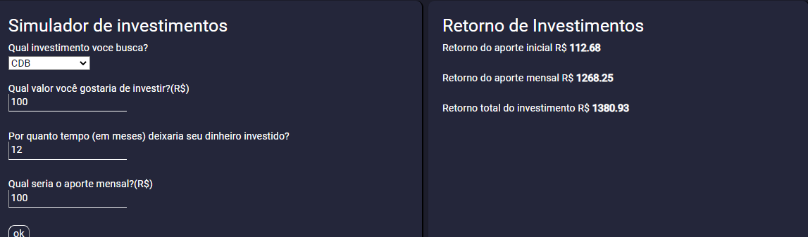

2- Caso de Insucesso: Caso o usuário não indique o aporte incial ou mensal como '0' quando não há o retorno total fica como inválido 'NaN'.

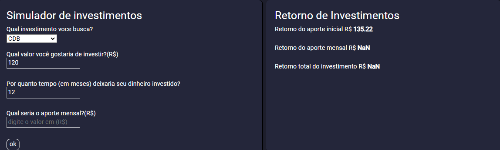