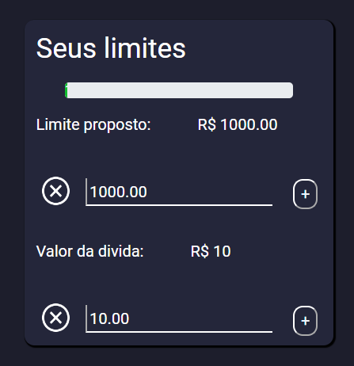
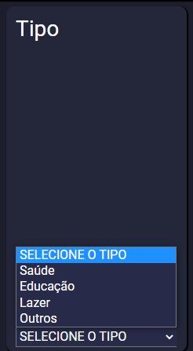
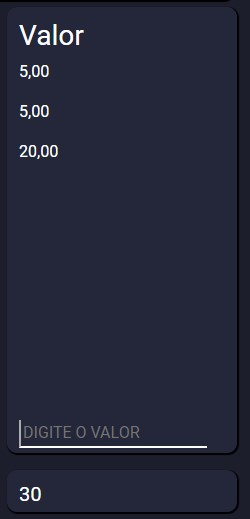
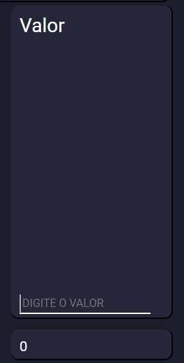

# Registro de Testes de Software

## Caso de teste 01 - Criação de um controlador de gastos

1- Caso de sucesso: Dados aparecem na tela.

2- Caso de Insucesso: Mensagem de erro com o campo vazio.

## Caso de teste 02 - Envio de alerta por email

1- Caso de sucesso: Email enviado caso o usuario ultrapasse 60% do valo estipulado

2- Caso de Insucesso: Email não enviado por está invalido.

## Caso de teste 03- Possibilidade da visualização de despesas atuais e futuras

1- Caso de sucesso: Somatorio das dividas Aparecendo corretamente.

2- Caso de insucesso: Valor das Dividas aparecendo zerado.

 

## Caso de teste 04 - Mostra Grafico em formato de pizza 

1- Caso de Sucesso: Grafico apresenta as cores e seus respectivos valores

2 - Caso de insucesso:  Grafico de uma única cor

## Caso de teste 01 - Vizualizar despesas futuras

1- Caso de sucesso: As datas inceridas pelo usuário aparecem na tela.

2 - Caso de insucesso:  Caso o usuário não preencha a data de sua compra o envio para o localStorage não poderá ser relizado.

## Caso de teste 02 - Vizualizar o tipo de compra

1- Caso de sucesso: O usuário poderá escolher o tipo de compra que mais se asemelha com o produto comprado.

2 - Caso de insucesso:  Caso o usuário não selecione o tipo da seu porduto comprado não será possivel a vizualização e armazenamento de seus dados, ficado totalmente limpo. 

## Caso de teste 04 - Soma dos valores inceridos

1- Caso de sucesso: Após a inclusão dos valores gastos pelo Usuário temos uma auto soma dos valores.

2 - Caso de insucesso:  Caso o usuário não inclua o valor em numeral a soma não poderá ser realizada.

